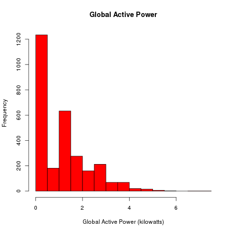
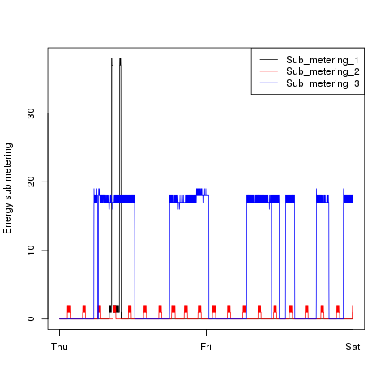
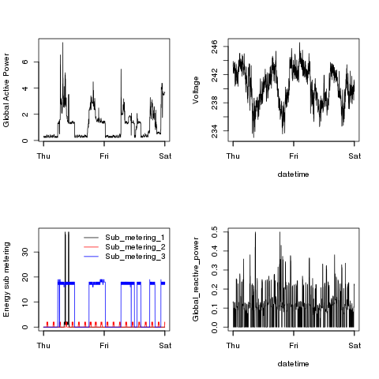

# Description

This directory contains .png files. It also contains .R files that created
them.

Example plots do not have resolution 480x480 as needed in
this task. Therefore my plots are a bit different in size than example plots.
But my graphs are transparent as example plots.

The .R files have enough comments so I will not explain anything here. :)

# Plots

Plots are included in this .md file for presenting them with white background.

## Plot 1

## Plot 2

## Plot 3

## Plot 4

